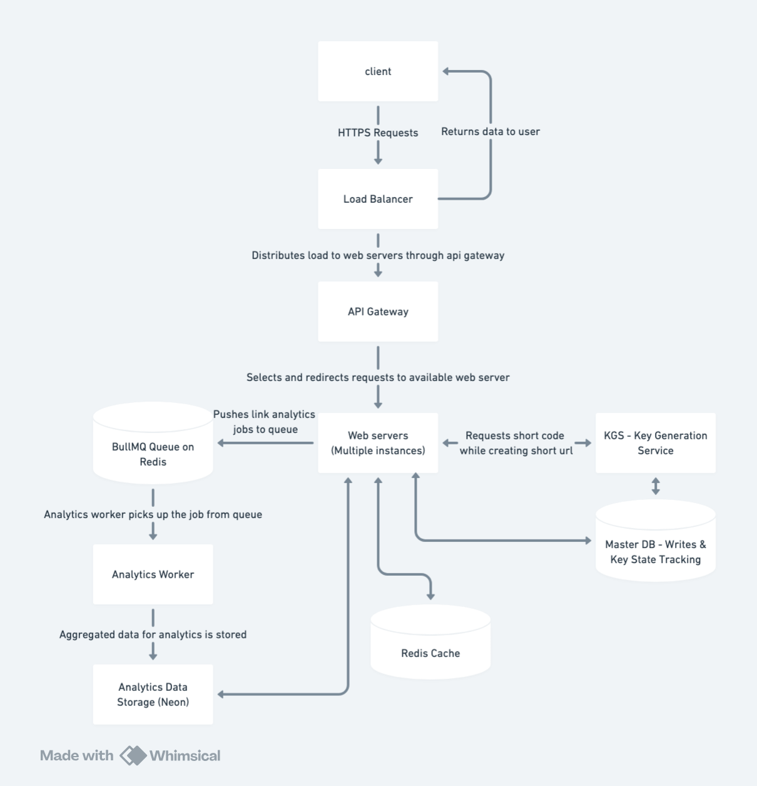

# Scalable URL Shortener — System Design

A URL shortener is a service that transforms long URLs into short, unique aliases. When a user clicks on the shortened link, the service redirects them to the original URL.

**Use Case:** Long URLs are visually unappealing and often exceed character limits on platforms like SMS or X (Twitter). A URL shortener provides a cleaner user experience and ensures compatibility across all communication channels.

**Example:**
* **Original URL:** `https://google.com/url-shortener-system-design?currentPage=1&orderBy=hot&query=`
* **Short URL:** `https://shorturl.com/4izy9Dn`

---

## 1. Requirements

### 1.1 Functional Requirements
* **Link Generation:** Generate a unique short URL for a provided long URL.
* **Redirection:** Redirect users to the original long URL upon accessing the short link.
* **User Authentication:** Allow users to manage their own links.
* **Analytics:** Provide metrics for link usage (total clicks, etc.).

### 1.2 Non-Functional Requirements
* **Low Latency:** Redirection must be as fast as possible.
* **Scalability:** The system must handle high traffic volumes.
* **High Availability:** Redirection must remain functional even during partial system failures.
* **Fault Tolerance:** Ensure no data loss if a service instance fails.

---

## 2. Capacity Estimation

### 2.1 Traffic
* **Read/Write Ratio:** 200:1 (For every 1 link created, we expect 200 redirects).
* **Write Throughput:** 100 million new URLs/month ≈ **40 URLs/second**.
* **Read Throughput:** 40 * 200 = **8,000 redirects/second**.

### 2.2 Storage
* **Lifetime:** 100 years.
* **Total Links:** 100 million * 12 months * 100 years = **120 billion links**.
* **Size per Link:** ~500 bytes.
* **Total Storage:** 120 billion * 500 bytes = **60 TB**.

### 2.3 Caching (Memory)
* Following the **Pareto Principle (80/20 Rule)**, we cache the top 20% of daily requests.
* **Daily Reads:** 8,000 requests/sec * 86,400 seconds ≈ 700 million reads/day.
* **Cache Requirement:** 20% of 700 million ≈ **70 GB of RAM**.

---

## 3. High-Level Design

1.  **Load Balancer & API Gateway:** Distributes traffic and handles security/rate limiting.
2.  **Application Servers:** Manage logic for authentication, link creation, and redirection.
3.  **KGS (Key Generation Service):** A dedicated service providing unique IDs to the servers.
4.  **Data Layer:** PostgreSQL for persistent storage and Redis for high-speed caching.
5.  **Analytics Pipeline:** Asynchronous workers processing events from a Message Queue.

---

## 4. API Endpoints

### 4.1 Link Creation
`POST /api/v1/create`
* **Parameters:** `long_url`, `api_key`, `custom_url (optional)`
* **Return:** The generated short URL or an error code.

### 4.2 Redirection
`GET /:short_code`
* **Status Code:** **302 Found** (Temporary Redirect).
* **Why 302?** Unlike 301 (Permanent), a 302 redirect ensures that the browser sends every request to our server, allowing us to capture accurate analytics for every click.

---

## 5. Database Schema
We utilize a relational database to handle joins and structured data.

### **Links Table**
* `short_code` (Primary Key)
* `original_long_url`
* `user_id` (Foreign Key)
* `created_at`
* `expires_at`
* `total_clicks`

> **Note on Scaling:** To manage 60 TB of data, we implement **Database Sharding** based on the `short_code` to distribute load across multiple nodes.

---

## 6. Shortening Algorithm (KGS)

We use a **Key Generation Service (KGS)** to ensure every short code is unique without performing a "check-if-exists" database query on every request.

* **Encoding:** We use **Base62** (`[0-9][a-z][A-Z]`).
* **Length:** A 7-character code provides $62^7 \approx 3.5 \text{ trillion}$ combinations, which exceeds our 120 billion requirement.

### KGS Logic:
Instead of generating keys one by one, KGS reserves ranges of IDs from the database in batches.
* Keys are stored in an **in-memory pool** for rapid access.
* If the KGS server fails, we lose the current in-memory batch, but we maintain uniqueness because those IDs are never reused.

---

## 7. Rate Limiting

To protect against API abuse, we implement a multi-layered rate-limiting strategy:
* **Sliding Window Log:** Used for Auth APIs (High accuracy/security).
* **Sliding Window Counter:** Used for Link Creation (Scalable and memory-efficient).
* **Token Bucket (Lua script):** Used for Redirects to handle high-volume traffic bursts with minimal latency.

---

## 8. Analytics Worker

At scale, analytics processing is a heavy task that should not block the user's redirect.
1.  When a redirect occurs, the server pushes an event to a **Message Queue**.
2.  **Analytics Workers** consume jobs from the queue asynchronously.
3.  Workers aggregate data (geography, click counts, device types) and update the Analytics Database.
4.  If a worker crashes, the job remains in the queue (with state tracking) to prevent data loss.